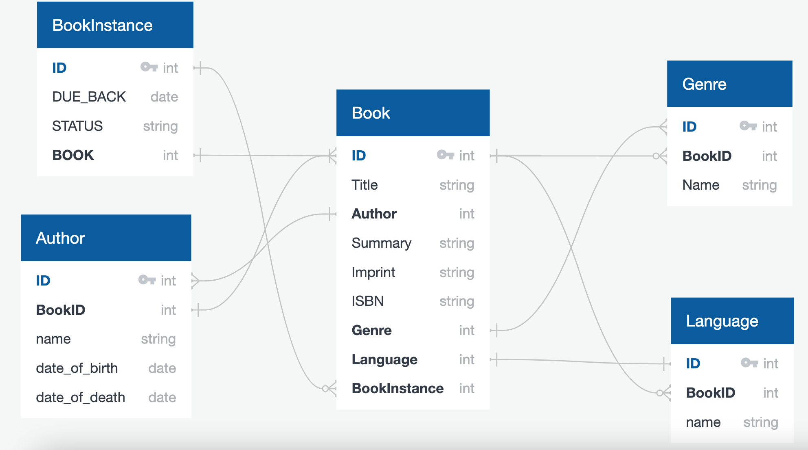

# Mozilla Django Learning

## Links
[Learn Django with MDN](https://developer.mozilla.org/en-US/docs/Learn/Server-side/Django)

## Stack
- Django
- TailwindCSS or Bootstrap
- Docker
- Heroku
- GitHub Actions

## Project

Environment variables:

Use GitHub Secrets, Heroku Config Vars or something secrets for ENV 
For Local environments use .env file, like this
```sh
cat .env
PYTHONDONTWRITEBYTECODE=1
PYTHONUNBUFFERED=1
DJANGO_SECRET_KEY=your_secret_key
DJANGO_DEBUG=True
DJANGO_ALLOWED_HOSTS=127.0.0.1, 0.0.0.0, localhost
DJANGO_PORT=8000
DJANGO_DATABASE_ENGINE=sqlite3
DJANGO_DATABASE_NAME=db.sqlite3
DJANGO_DATABASE_USERNAME=myprojectuser
DJANGO_DATABASE_PASSWORD=password
DJANGO_DATABASE_HOST=127.0.0.1
DJANGO_DATABASE_PORT=5432
DJANGO_STATIC_ACCESS_KEY_ID=your_space_access_key_id
DJANGO_STATIC_SECRET_KEY=your_space_secret_key
DJANGO_STATIC_BUCKET_NAME=your_space_name
DJANGO_STATIC_ENDPOINT_URL=https://nyc3.digitaloceanspaces.com
DJANGO_STATIC_ROOT=staticfiles/ # /var/www/itproger-learning-django/static/
DJANGO_MEDIA_ROOT=mediafiles/ # /var/www/itproger-learning-django/media/
DJANGO_LOGLEVEL=info
```

```sh
docker run --env-file src/.env -d -p 8000:8000 itproger-django:0.12
```

Database Structure
```sql
CREATE TABLE "Book" (
    "ID" int   NOT NULL,
    "Title" string   NOT NULL,
    "Author" int   NOT NULL,
    "Summary" string   NOT NULL,
    "Imprint" string   NOT NULL,
    "ISBN" string   NOT NULL,
    "Genre" int   NOT NULL,
    "Language" int   NOT NULL,
    "BookInstance" int   NOT NULL,
    CONSTRAINT "pk_Book" PRIMARY KEY (
        "ID"
     )
);

CREATE TABLE "Author" (
    "ID" int   NOT NULL,
    "BookID" int   NOT NULL,
    "name" string   NOT NULL,
    "date_of_birth" date   NOT NULL,
    "date_of_death" date   NOT NULL,
    CONSTRAINT "pk_Author" PRIMARY KEY (
        "ID"
     )
);

CREATE TABLE "Genre" (
    "ID" int   NOT NULL,
    "BookID" int   NOT NULL,
    "Name" string   NOT NULL,
    CONSTRAINT "pk_Genre" PRIMARY KEY (
        "ID"
     )
);

CREATE TABLE "Language" (
    "ID" int   NOT NULL,
    "BookID" int   NOT NULL,
    "name" string   NOT NULL,
    CONSTRAINT "pk_Language" PRIMARY KEY (
        "ID"
     )
);

CREATE TABLE "BookInstance" (
    "ID" int   NOT NULL,
    "DUE_BACK" date   NOT NULL,
    "STATUS" string   NOT NULL,
    "BOOK" int   NOT NULL,
    CONSTRAINT "pk_BookInstance" PRIMARY KEY (
        "ID"
     )
);

ALTER TABLE "Book" ADD CONSTRAINT "fk_Book_Author" FOREIGN KEY("Author")
REFERENCES "Author" ("ID");

ALTER TABLE "Book" ADD CONSTRAINT "fk_Book_Genre" FOREIGN KEY("Genre")
REFERENCES "Genre" ("ID");

ALTER TABLE "Book" ADD CONSTRAINT "fk_Book_Language" FOREIGN KEY("Language")
REFERENCES "Language" ("ID");

ALTER TABLE "Book" ADD CONSTRAINT "fk_Book_BookInstance" FOREIGN KEY("BookInstance")
REFERENCES "BookInstance" ("ID");

ALTER TABLE "Author" ADD CONSTRAINT "fk_Author_BookID" FOREIGN KEY("BookID")
REFERENCES "Book" ("ID");

ALTER TABLE "Genre" ADD CONSTRAINT "fk_Genre_BookID" FOREIGN KEY("BookID")
REFERENCES "Book" ("ID");

ALTER TABLE "Language" ADD CONSTRAINT "fk_Language_BookID" FOREIGN KEY("BookID")
REFERENCES "Book" ("ID");

ALTER TABLE "BookInstance" ADD CONSTRAINT "fk_BookInstance_BOOK" FOREIGN KEY("BOOK")
REFERENCES "Book" ("ID");
```




Project structure
```sh
$ cd project_repository_folder/  <- Repo from github
$ django-admin startproject config && mv config src
$ tree
.
├── Dockerfile
├── LICENSE
├── README.md
├── _config.yml   # config for GitHub Pages
├── assets   # project info for README.md 
│   └── img
├── dist   # files for GitHub Pages
│   ├── css
│   ├── img
│   ├── index.html
│   └── style.css
├── heroku.yml   # config for Heroku
├── package-lock.json   # for Docker build
├── package.json   # for Docker build and GitHub Actions
├── src/...   # Django Project Source Code
├── tailwind.config.js   # Config for TailwindCSS
└── venv   # local venv
```


Django Project Structure
```sh
$ cd project_repository_folder/  <- Repo from github
$ django-admin startproject config
$ mv config src
README
LICENSE
.gitignore
src/                  <- project root - django-admin startproject config - and rename to src
├── config/              <- Django root - django-admin startproject config
│   ├── __init__.py
│   ├── __pycache__
│   ├── asgi.py
│   ├── create_rundom_secret.py
│   ├── settings.py
│   ├── urls.py
│   └── wsgi.py
├── main   # app with name - main
│   ├── __init__.py
│   ├── __pycache__
│   ├── admin.py
│   ├── ...
│   └── views.py
├── manage.py
├── news   # app with name - news
│   ├── __init__.py
│   ├── __pycache__
│   ├── admin.py
│   ├── ...
│   └── views.py
├── static   # static file - tailwind, css with tailwind minify classes
│   ├── css
│   ├── img
│   └── tailwind.css
└── templates   # templates for Django
```
